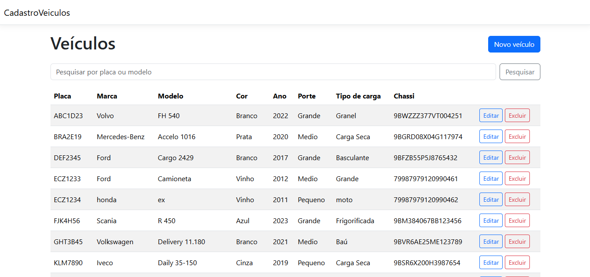
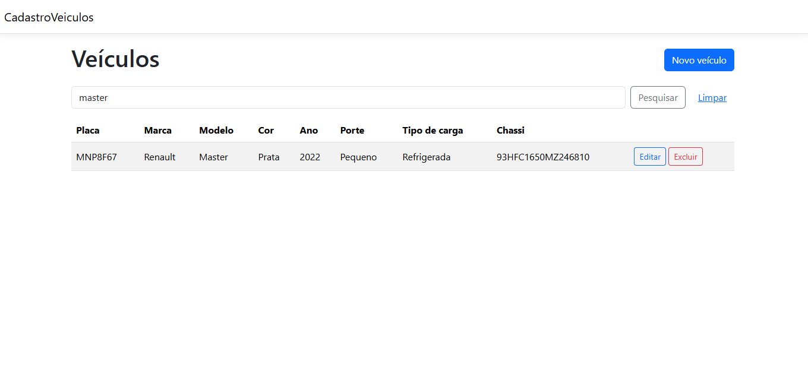
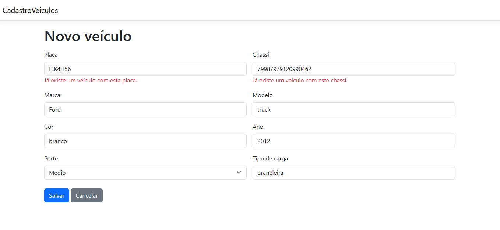
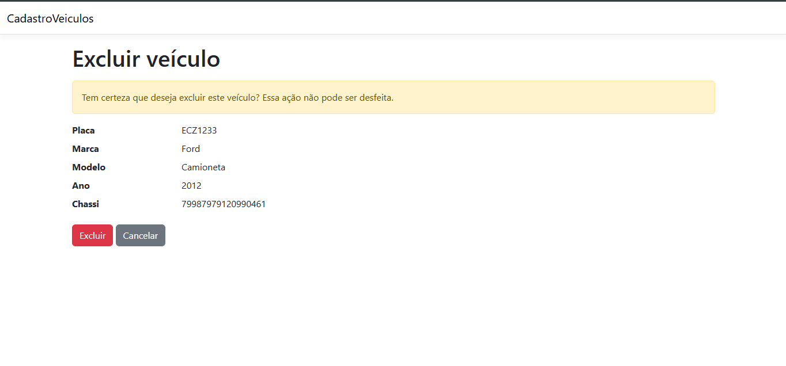

# Cadastro de Veículos

Aplicação web para cadastro de veículos com as operações de CRUD (cadastrar, listar, alterar e excluir) e pesquisa por placa ou modelo, desenvolvida como exercício técnico.

## Tecnologias

- **C# / .NET 10** com **ASP.NET Core MVC** (views em Razor)
- **MySQL 8**
- **Dapper** (micro-ORM) com o driver **MySqlConnector**
- **Bootstrap** (já incluso no template do ASP.NET)

### Por que MySQL em vez de SQL Server

O exercício indica SQL Server como preferencial, mas permite outro banco. Optei pelo MySQL por ser o banco que eu já tinha configurado no meu ambiente. Todo o acesso a dados fica concentrado na camada de repositório, então trocar para SQL Server exigiria alterar apenas o driver, a connection string e pequenas diferenças de sintaxe no SQL.

## Pré-requisitos

- [.NET SDK 10](https://dotnet.microsoft.com/download)
- MySQL **8.0.16 ou superior**
- MySQL Workbench ou outro cliente SQL (opcional, para rodar os scripts)

## Como executar

**1. Clonar o repositório**

```bash
git clone https://github.com/SEU_USUARIO/CadastroVeiculos.git
cd CadastroVeiculos
```

**2. Criar o banco de dados**

Execute os scripts da pasta `database/scripts`, nesta ordem:

```bash
mysql -u root -p < database/scripts/create_database.sql
mysql -u root -p < database/scripts/seed.sql
```

O `create_database.sql` cria o banco `cadastro_veiculos`, a tabela e as constraints. O `seed.sql` é opcional e insere veículos de exemplo. Atenção: ele limpa a tabela antes de inserir.

**3. Configurar a conexão**

Em `src/CadastroVeiculos/appsettings.json`, troque `SUA_SENHA` pela senha do seu MySQL:

```json
"ConnectionStrings": {
  "Default": "Server=localhost;Port=3306;Database=cadastro_veiculos;User ID=root;Password=SUA_SENHA;"
}
```

**4. Rodar a aplicação**

```bash
cd src/CadastroVeiculos
dotnet run
```

Acesse o endereço exibido no terminal (por padrão, `http://localhost:5272`).

## Estrutura do projeto

```
CadastroVeiculos/
├── database/scripts/       # Scripts SQL de criação e dados de exemplo
├── prints/            # Capturas de tela da aplicação
└── src/CadastroVeiculos/
    ├── Controllers/        # Recebe as requisições e escolhe a tela
    ├── Data/               # Fábrica de conexões com o banco (Singleton)
    ├── Models/             # Entidade Veiculo e validações de campo
    ├── Repositories/       # Acesso ao banco (SQL com Dapper)
    ├── Services/           # Regras de negócio
    └── Views/              # Telas (Razor + Bootstrap)
```

## Padrões utilizados

- **MVC**: separação entre dados (Model), telas (View) e controle do fluxo (Controller).
- **Singleton**: usado na `ConexaoFactory`, responsável por criar as conexões com o banco. A classe tem construtor privado e uma única instância estática, inicializada uma vez no `Program.cs` com a connection string. Como a instância é criada na inicialização, antes de a aplicação receber requisições, não há risco de duas threads criarem instâncias diferentes.
- **Repository**: o `VeiculoRepository` é a única classe que escreve SQL. As demais camadas não sabem qual banco está sendo usado.
- **Service Layer**: o `VeiculoService` concentra as regras de negócio, mantendo o controller simples.

## Regras de negócio

- Todos os campos são obrigatórios.
- A placa é gravada em letras maiúsculas e sem hífen (`abc-1d23` é salva como `ABC1D23`).
- A placa aceita os formatos antigo (`ABC1234`) e Mercosul (`ABC1D23`).
- O chassi deve ter 17 caracteres, sem as letras I, O e Q (padrão VIN), e também é gravado em maiúsculas.
- O ano deve estar entre 1900 e o ano atual + 1.
- O porte deve ser Pequeno, Medio ou Grande.
- Placa e chassi não podem se repetir. Na edição, o próprio veículo é desconsiderado na verificação.
- Todos os erros são exibidos com mensagens amigáveis, junto ao campo correspondente.

As validações existem em duas camadas: na aplicação, que gera as mensagens para o usuário, e no banco, com `UNIQUE`, que garante a integridade mesmo se os dados forem inseridos por fora da aplicação. Se dois cadastros com a mesma placa chegarem ao mesmo tempo, o erro de duplicidade do banco (código 1062) também é convertido em mensagem amigável.

## Processo de desenvolvimento

Eu não tinha experiência com C# antes deste exercício, então usei as primeiras horas do prazo de 72 horas para estudar o básico da linguagem e do ASP.NET Core MVC.

Minha base é Java, e senti bastante familiaridade: a sintaxe é muito parecida, e vários conceitos têm equivalentes diretos, como propriedades no lugar de getters e setters, Data Annotations no papel do Bean Validation, e o `using` funcionando como o try-with-resources.

As decisões de arquitetura e de escrita do código vieram da minha formação em Engenharia de Software. Em Orientação a Objetos IV aprendi o padrão MVC e desenvolvi um projeto semelhante em Java, um sistema de aluguel de veículos, o que facilitou muito a organização deste exercício. Na disciplina de Padrões de Projeto aprendi o Singleton, aplicado aqui na factory. E a experiência anterior com o Spring Framework ajudou a entender rapidamente conceitos do ASP.NET Core, como controllers, injeção de dependência e arquivos de configuração, que funcionam de forma bem parecida.

Pesquisei principalmente as convenções de nomenclatura do C#, a implementação do padrão Singleton na linguagem e as classes do Bootstrap usadas nas telas.

## Prints

**Listagem**



**Pesquisa por placa ou modelo**



**Validação de placa e chassi**



**Confirmação de exclusão**



## Referências

- [Visão geral do ASP.NET Core MVC](https://learn.microsoft.com/aspnet/core/mvc/overview)
- [Validação de modelos no ASP.NET Core MVC](https://learn.microsoft.com/aspnet/core/mvc/models/validation)
- [Sintaxe Razor](https://learn.microsoft.com/aspnet/core/mvc/views/razor)
- [Convenções de nomenclatura do C#](https://learn.microsoft.com/dotnet/csharp/fundamentals/coding-style/identifier-names)
- [Singleton em C# (Refactoring Guru)](https://refactoring.guru/pt-br/design-patterns/singleton/csharp/example)
- [Dapper](https://github.com/DapperLib/Dapper)
- [MySqlConnector](https://mysqlconnector.net/)
- [Documentação do Bootstrap](https://getbootstrap.com/docs/5.3/getting-started/introduction/)

## Licença

Este projeto está sob a licença MIT. Veja o arquivo [LICENSE](LICENSE) para mais detalhes.

## Autor

Josias H.
